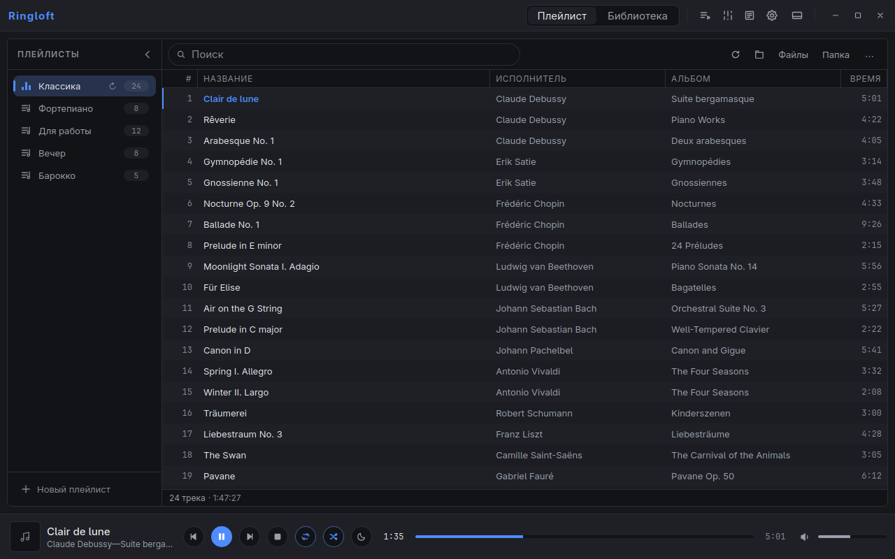
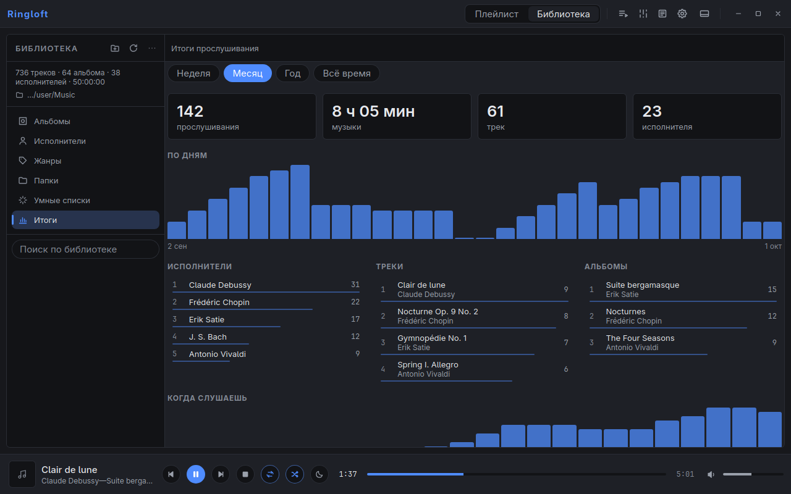

# Ringloft

A fast desktop audio player for large local music collections — tens of
thousands of tracks, lossless files, CUE sheets, synced lyrics. Runs on Linux
(X11 and Wayland) and Windows 10/11.

> The interface is currently available in Russian only.



## Features

**Sound**
- FLAC, MP3, AAC/M4A, ALAC, Ogg Vorbis, Opus, WAV, AIFF and MKA, CUE sheets,
  and internet radio with live track titles.
- Gapless playback and crossfade.
- Volume leveling: ReplayGain from tags, or let Ringloft measure loudness
  itself (EBU R128) and save the result to your files.
- 10-band equalizer and headphone correction for thousands of models from
  [AutoEQ](https://github.com/jaakkopasanen/AutoEq).
- Plays files at their native sample rate when your audio device supports it.
- Sleep timer with a gentle fade-out, and “stop after this track”.

**Playlists and library**
- Playlists as tabs or as a sidebar; drag and drop tracks and playlists; a
  play queue; repeat and shuffle remembered per playlist.
- Playlists remember the folders they came from and pick up new files
  automatically.
- A library view by album, artist, genre and folder, with smart playlists and
  instant search.
- Listening stats: your top artists, tracks and albums, and when you listen.
- Choose the columns you want: year, genre, format, bitrate, play count,
  rating.
- Finds duplicate tracks and files that went missing.

**Tags, lyrics and covers**
- Tag editor and renaming by template. Deleted files go to the trash, never
  straight to oblivion.
- Fix messy tags by sound: Ringloft recognizes the track and suggests the
  right title, artist, album and year (AcoustID and MusicBrainz).
- Finds missing album covers online and saves them into your files.
- Synced lyrics from `.lrc` files, tags or [lrclib.net](https://lrclib.net),
  for one track or the whole collection.

**Everyday comfort**
- Full-screen view with large artwork and lyrics, and a compact mini player.
- Media keys, system media controls (MPRIS on Linux, the media overlay on
  Windows), tray icon and track notifications.
- Last.fm scrobbling and Discord status.
- Light and dark themes, your own accent color — or one picked from the
  current album cover — and adjustable font and font size.



## Download

Get the latest version from the [Releases page](../../releases/latest):

| System | File | How to install |
| --- | --- | --- |
| Windows 10/11 | `ringloft_…_x64-setup.exe` (or the `.msi`, Russian-language installer) | run the installer |
| Ubuntu, Debian, Mint | `ringloft_…_amd64.deb` | `sudo apt install ./ringloft_*_amd64.deb` |
| Fedora, openSUSE | `ringloft-…x86_64.rpm` | `sudo dnf install ./ringloft-*.x86_64.rpm` |
| Any other Linux | `ringloft_…_amd64.AppImage` | `chmod +x ringloft_*.AppImage`, then run it |

Notes:
- **Windows** needs Microsoft Edge WebView2. It is already part of Windows 11
  and up-to-date Windows 10; otherwise the installer downloads it. The builds
  are not code-signed yet, so SmartScreen may ask for confirmation: choose
  *More info → Run anyway*.
- **Linux** packages need a reasonably recent system (glibc 2.39 or newer:
  Ubuntu 24.04, Debian 13, Fedora 40, current Arch, or newer). On older
  systems, [build from source](#building-from-source).

## Getting started

- **Add music:** use *Файлы* (files) or *Папка* (folder) on the playlist
  toolbar, or just drop files and folders onto the window. For the library,
  switch to *Библиотека* and add your music folder there.
- **Open files from your file manager:** the Windows installer and the
  Linux packages register Ringloft for audio files, so “Open with” and
  double-click work. Opened files play in a separate temporary tab and don't
  mess up your playlists.
- **Keyboard:** press **F1** to see all shortcuts.
- **Right-click** tracks, playlists, albums and the cover in the player bar
  for more actions.
- **Command line:** `ringloft --play-pause`, `--play`, `--pause`, `--stop`,
  `--next`, `--prev` control a running Ringloft — handy for custom global
  shortcuts. `ringloft some.flac` opens and plays a file.
- **Native sample rate on Linux:** PipeWire resamples everything to one rate
  by default. To play files at their own sample rate, allow other rates in
  *Settings → Звук → Частота*.

## Online features

Everything online is optional and happens only when you ask for it.

| Feature | What you need |
| --- | --- |
| Lyrics (lrclib), headphone profiles (AutoEQ), cover art (iTunes, Cover Art Archive) | nothing |
| Discord status | nothing — just enable it in the settings |
| Last.fm scrobbling | your own free API key and secret: [last.fm/api/account/create](https://www.last.fm/api/account/create) |
| Tag lookup by sound (AcoustID) | your own free application key: [acoustid.org/new-application](https://acoustid.org/new-application) |

## Where your data lives

| | Linux | Windows |
| --- | --- | --- |
| Settings, playlists, library | `~/.config/ringloft/`, `~/.local/share/ringloft/` | `%APPDATA%\ringloft\` |
| Cover thumbnails and other caches | `~/.cache/ringloft/` | `%LOCALAPPDATA%\ringloft\` |

Your music files are only changed when you explicitly edit tags, save lyrics,
write loudness tags or covers, rename or delete files.

## Building from source

You need Rust 1.89+, Node.js 20+ and a few system libraries.

```bash
# Arch Linux
sudo pacman -S --needed base-devel webkit2gtk-4.1 libayatana-appindicator dbus alsa-lib pipewire clang cmake

# Debian / Ubuntu
sudo apt install build-essential libwebkit2gtk-4.1-dev libayatana-appindicator3-dev \
  libdbus-1-dev libasound2-dev libpipewire-0.3-dev libclang-dev cmake
```

Then build:

```bash
npm install
npm run tauri build
```

The player ends up in `src-tauri/target/release/ringloft`, ready-made
packages in `src-tauri/target/release/bundle/`. Use `npm run tauri build`
rather than plain `cargo build`: only it bundles the interface into the
binary.

## License

Ringloft is released under the [MIT License](LICENSE).

It includes components under their own licenses, among them
[Symphonia](https://github.com/pdeljanov/Symphonia) (MPL-2.0),
[libopus](https://opus-codec.org/license/) (BSD-3-Clause) and the Inter,
Manrope, Golos Text and Nunito fonts (SIL Open Font License 1.1). Lyrics,
headphone profiles, cover art and music metadata fetched from online
services remain under the terms of their sources.
